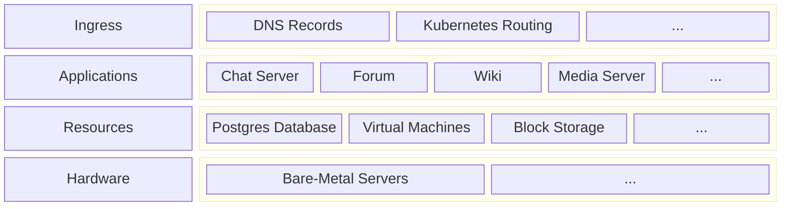
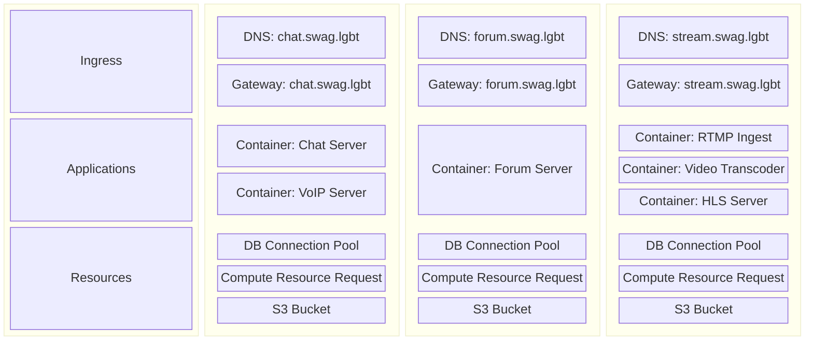

# Infrastructure

A big part of this repo is infrastructure (rather than application) code. That means code defining how services communicate with each other, how users can reach services, and which (and how many) resources different services have access to.

## Infrastructure-as-Cake Model

To me, the infrastructure defined in this repo fits into four broad layers, much like a too-tall cake. In order from highest level of abstraction to lowest, they are: Ingress, Applications, Resources, and Hardware.

### Ingress

This is the first layer of the cake. "Ingress" here is being used to describe the general process of network traffic entering swagLGBT. This means routing traffic through [DNS Records](https://www.cloudflare.com/learning/dns/dns-records/), [K8s Gateways](https://kubernetes.io/docs/concepts/services-networking/gateway/), and things of that nature.

Essentially, the ingress layer routes network requests to apps that can serve those connections; if we want to expose a swagLGBT application to the internet, there will need to be some sort of ingress happening.

### Applications

Applications are the meat and potatoes, the bread and butter, the home and lab of swagLGBT. It's the code that actually runs, the apps like [TURN Servers](https://github.com/coturn/coturn), [Chat Servers](https://matrix.org/), [Wikis](https://js.wiki/), and [Forums](https://www.discourse.org/) for example.

As of now, these apps are [containerized](https://cloud.google.com/discover/what-are-containerized-applications) and run in [Kubernetes](https://kubernetes.io/), but that's not set in stone -- it's just what I'm familiar with.

### Resources

Resources like [databases](https://learnsql.com/blog/sql-database/), [object storage](https://www.cloudflare.com/learning/cloud/what-is-object-storage/), and [virtual machines](https://azure.microsoft.com/en-us/resources/cloud-computing-dictionary/what-is-a-virtual-machine/) sit conceptually "below" the application layer and can be shared by different applications.

### Hardware

Finally, at the lowest level I care to think about, are the actual [bare-metal servers](https://en.wikipedia.org/wiki/Bare-metal_server) that contain the RAM, CPU, GPU, SSD, and all those other acronyms. In other words, this layer is the actual computers.

Rather than have a single integrated build system like [Pants](https://pantsbuild.org) or [Bazel](https://bazel.build), I've opted to overlap several different language-specific build systems. Javascript

## Slicing the Cake Vertically

While that chart is useful for conceptualizing the _horizontal_ layers of infrastructure necessary to power swagLGBT, this repository is actually organized _vertically_, meaning that each application's infrastructure is defined in alongside the application code.

To put it in terms of the above chart:

As you can see, each application owns its own vertical "slice" of cake which contains multiple layers, much like a real cake. The only layer actually organized horizontally is the shared infrastructure everything sits on top of, which is defined separately from application code.

## Enough Cake, Let's Get Tofu Involved

More concretely, the swagLGBT infrastructure is defined using [OpenTofu](https://opentofu.org/), which is a fork of [Terraform](https://www.terraform.io/) ([read more here](https://opentofu.org/manifesto/)). This means there's loads of `.tf` files all around the repo, each defining some piece of infrastructure. When any tofu file is modified, created, or deleted, [CI](https://en.wikipedia.org/wiki/Continuous_integration) will automatically [plan](https://github.com/swagLGBT/swagLGBT/actions/workflows/tofu-plan.yml) and [apply](https://github.com/swagLGBT/swagLGBT/actions/workflows/tofu-apply.yml) changes to the real-life infrastructure swagLGBT is running on.

Essentially what I want is for the state of swagLGBT's infrastructure to be a read-only instantiation of what is defined in this repository's code. That means no manual configuration, no "oh crap I forgot to stand up this server", everything is [declarative](https://learn.microsoft.com/en-us/azure/cloud-adoption-framework/ready/considerations/infrastructure-as-code#tooling). That's the idea, anyway.

## TL;DR

Apps (in [`/apps`](/apps)) own their own tofu from ingress down to [resource requests](https://kubernetes.io/docs/concepts/configuration/manage-resources-containers/). Compute nodes, managed DB's, and other shared resources are defined in [`/infra`](/infra). All infrastructure is defined with [OpenTofu](https://opentofu.org/docs/language/) in `.tf` files, and is separated into different [modules](https://opentofu.org/docs/language/modules/).

# Applications and Services

Obviously swagLGBT wouldn't be much of anything if there wasn't any code running. While by day I'm a programmer, writing application/systems/website code, there's not too too much of that here -- mostly, other people have written the code, and we just run it.

This means swagLGBT runs code written in a variety of languages by a variety of people.
